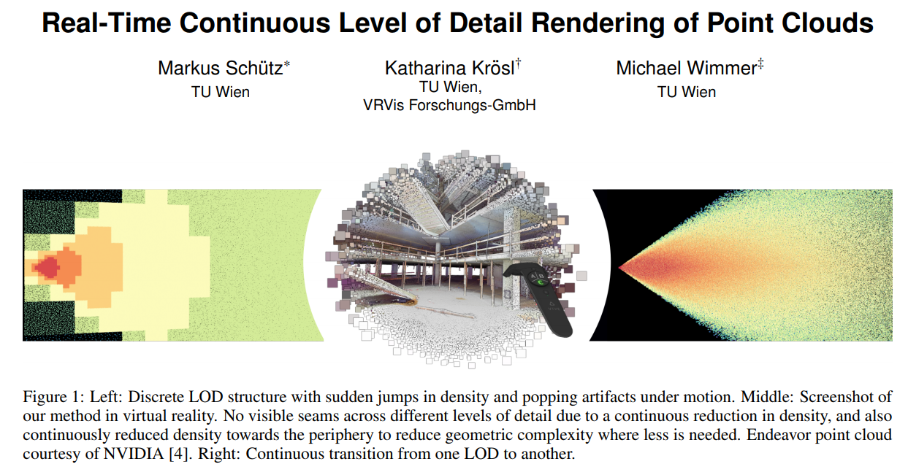

# ieeevr_2019_clod

Source for paper: "Real-Time Continuous Level of Detail Rendering of Point Clouds",
Markus Schütz, Katharina Krösl, Michael Wimmer,
IEEE VR 2019, March, Osaka

The full source code is part of the [Fenek](https://github.com/m-schuetz/Fenek) live coding framework.

Preprints are available [here](https://www.cg.tuwien.ac.at/research/publications/2019/schuetz-2019-CLOD/).



The compute shader ```filter_points.cs``` is executed for each point of the 
full point cloud (inputBuffer) and it stores a selected subset 
with continuous LOD properties in a new vertex buffer (targetBuffer).

```pointcloud_clod.vs``` then renders the downsampled vertex buffer and also computes point sizes based on the sampling density / target spacing.

- This is an in-core method. However, it should theoretically be possible to apply it to most LOD methods that follow the [layered point clouds scheme](https://dl.acm.org/citation.cfm?id=1652364) (e.g. [Potree](https://www.cg.tuwien.ac.at/research/publications/2016/SCHUETZ-2016-POT/), [Entwine](https://entwine.io/), ...) by dropping excess points of a node in the vertex shader. We did not do this at this time because state-of-the-art hierarchical methods are notoriously bad at handling highly complex geometries such as indoor environments. Our, currently in-core, continuous LOD method does not work on spatial acceleration structures such as Octrees, KD-Trees, etc. instead, it iterates over all points to compute the ideal subset for the current viewpoint, which is feasible for data sets up to 100M points because the downsampling step is essentially little more than a highly performant and cache friendly copy operation from one GPU buffer to another.
- It downsamples ~86M points to 5M points in ~5.45ms on a GTX 1080 => 15.9M points / ms.
- Initial tests for an RTX 2080 TI have shown performances of roughly ~86M points to 3M points in ~2ms => 43M points / ms. For reference, a frame in VR has to be computed in around 11ms.
- The data structure is a series of subsamples of the original point cloud, essentially a flattened version of a layered point cloud scheme (in our case Potree), with the level as an additional attribute in the color channel of each point. The points are stored in an unordered large vertex buffer and the level attribute provides all the necessary hierarchical information. Our current structure does not group points in nodes/tiles/...
- In VR, this method is distributed over multiple frames, 
  e.g. process 18M points per frame of the input buffer,
  which takes roughly 1.1ms per frame. 
  After 5 frames, the new downsampled vertex buffer is finished
  and it will be used to render the point cloud for the next 5 frames.
- Points are culled against an "extented-frustum" so that enough points are available 
  during motion even though the rendered model is computed for the frustum from 5 frames earlier.
- Distribution of the downsampling step over multiple frames is actually not necessary anymore for the 2080 TI.
  The same models with the same LOD can be downsampled and rendered at 90FPS in a single frame on a 2080 TI, 
  compared to a 1080 that required distribution of the downsampling step over ~5 frames. 
  Also, MSAA was set to 8x at the 2080 TI instead of 4x on the 1080, while still rendering at 90fps.

An out-of-core continuous LOD method for arbitarily large point clouds is currently in work.
